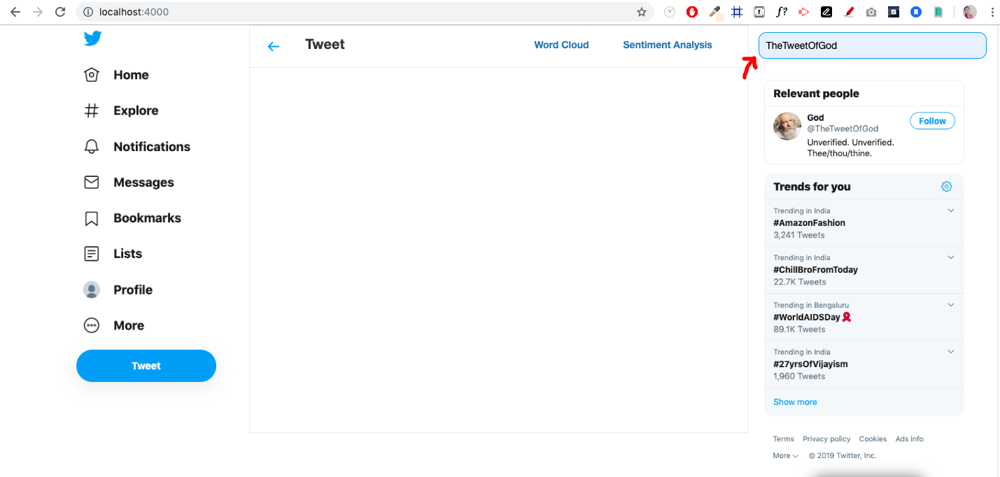
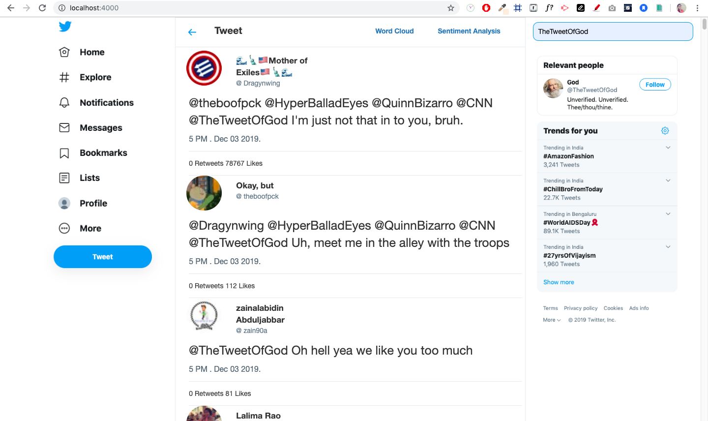
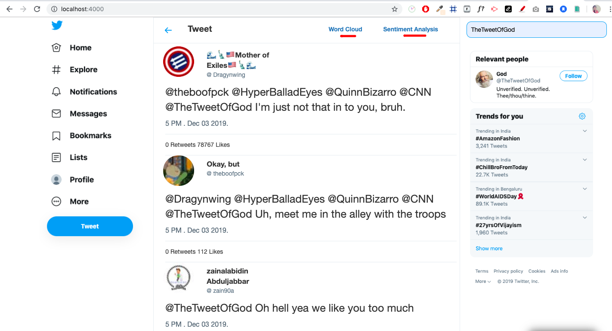
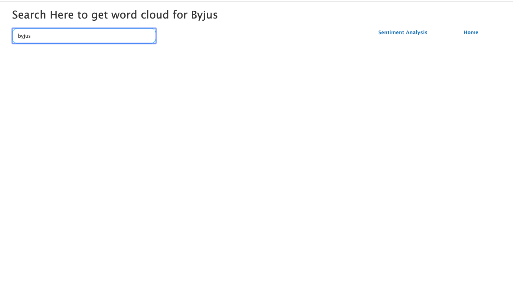
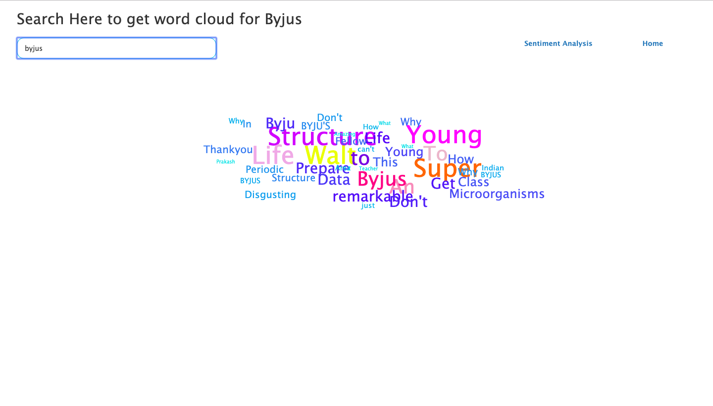
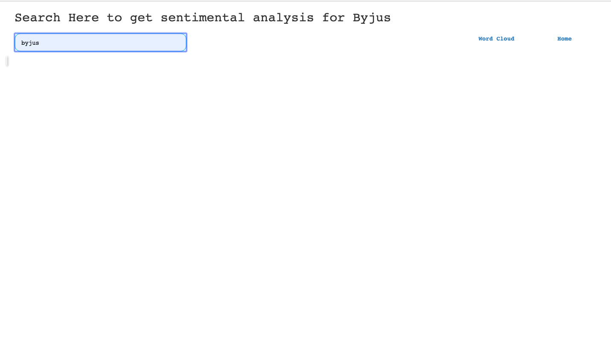
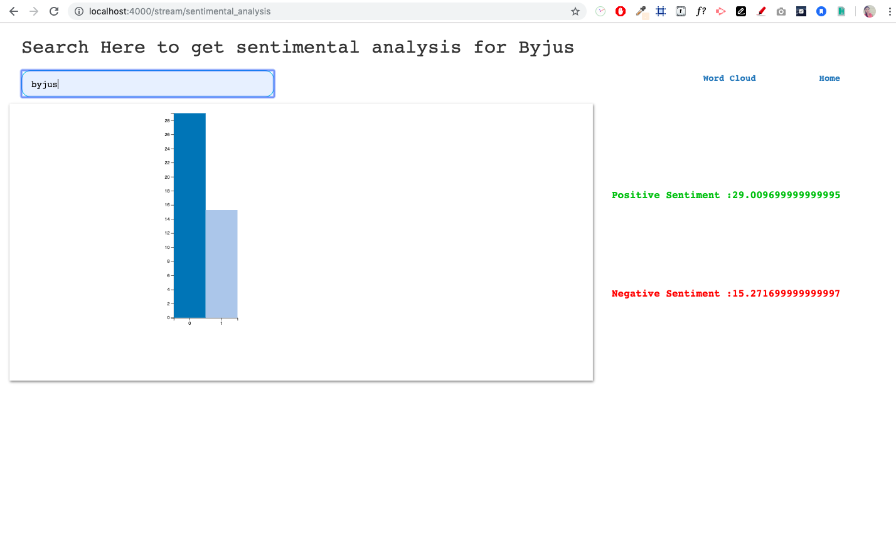

# Mini Twitter

Mini Twitter is a small web application, mainly build to `search` real time tweets and features include `word cloud` and `sentimental analysis` 

#### Technology Used
```
* Ruby - 2.4.3
* Rails - 5.2.3
* d3.js
* Bootstrap - Design
```

#### Features

* Search tweet which you wants to view. User can see the tweets in real time.

* You can form a word cloud for tweet seach result.

    ```
    d3.js used to form word cloud
    ```

* You can analyze sentiment of the tweet.

    ```
    gem 'sentimental'
    d3.js 
    ```

#### How to use the application

1. Type tweet name in the search box and press enter



2. You can able to view list of related tweets



3. Use navigation's in the top right corner



4. Type Tweet name, for which you want to form word cloud.



5. You can able to see formed word cloud



6. Type Tweet name, for which you want to do sentimental analysis.



7. You can able to see sentimental analysis result



-----------
